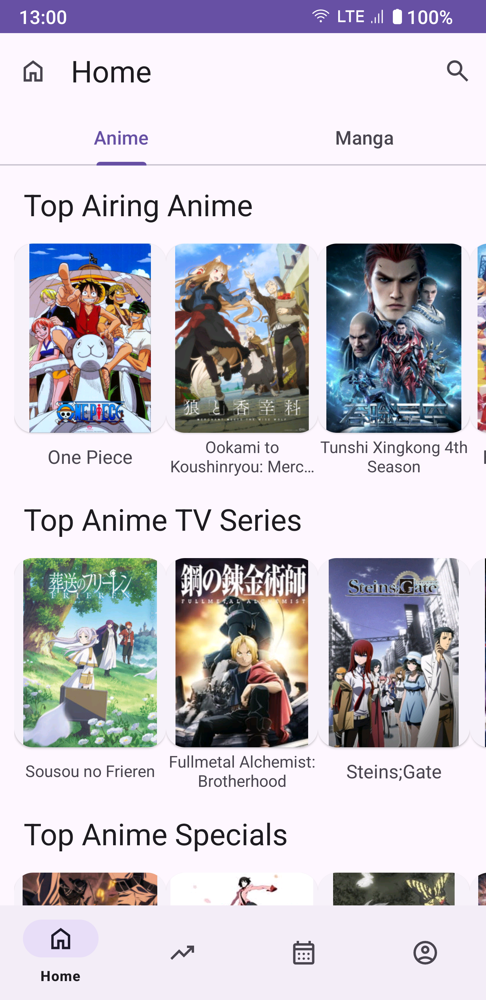

  

<h1 align="center">OpenMAL</h1>

OpenMAL is a modern Android client for MyAnimeList website. It focuses mainly on performance and usability. 

# Features
This is a work in progress in early stages. The edges are rather rough. Should be somewhat usable however. Current features include:
- Browsing titles from selected Top categories. This includes both Anime and Manga
- Details view of each title. Airing date, season, synopsis ...
- View items from your profile and filter/sort them.
- Edit your progress in a title: watched episodes, rate the work ...
- Explore Anime for the past, current, and next seasons.
- Support for dark and night mode.

# Screenshots
<table>
  <tr>
    <td></td>
    <td></td>
    <td></td>
    <td></td>
  </tr>
   <tr>
    <td></td>
    <td></td>
    <td></td>
  </tr>
</table>

# Disclaimer
MyAnimeList is a trademark of MyAnimeList Co.,Ltd.

# License
Copyright (C) 2024  AIT GACEM Nabil

This program is free software: you can redistribute it and/or modify
it under the terms of the GNU General Public License as published by
the Free Software Foundation, either version 3 of the License, or
(at your option) any later version.

This program is distributed in the hope that it will be useful,
but WITHOUT ANY WARRANTY; without even the implied warranty of
MERCHANTABILITY or FITNESS FOR A PARTICULAR PURPOSE.  See the
GNU General Public License for more details.

You should have received a copy of the GNU General Public License
along with this program.  If not, see https://www.gnu.org/licenses/
